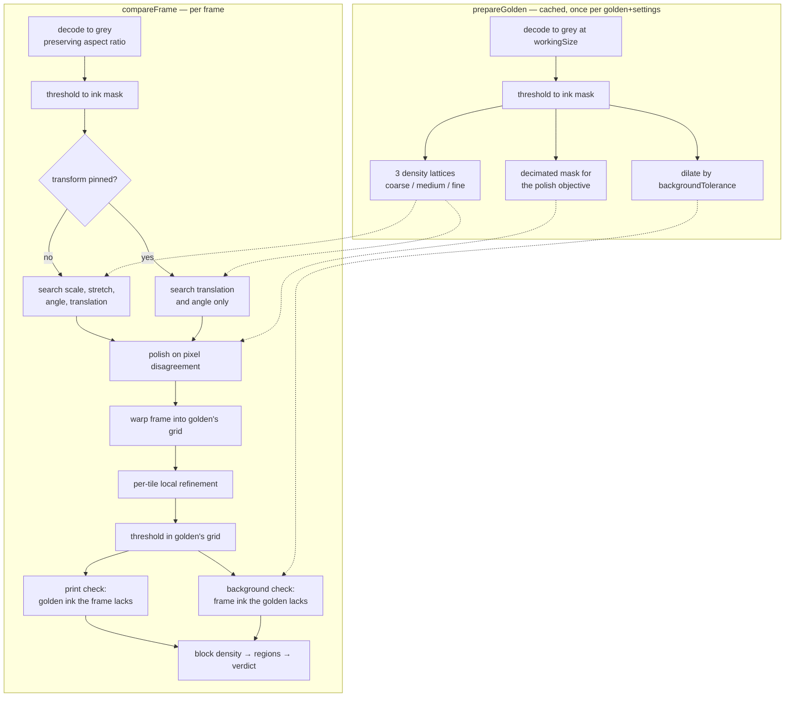

# Architecture

What this node is doing, in what order, and why each piece is shaped the
way it is. `README.md` is the operator's guide — what the settings mean
and how to use them. This is the map for changing the code.

## The problem

Compare **the PDF artwork for a label** against **a photograph of that
label printed**, and report where the print is wrong.

Almost every difficulty follows from those two inputs sharing nothing:

| | golden | frame |
| --- | --- | --- |
| origin | vector artwork, rendered | camera capture |
| tone | synthetic pure black on pure white | continuous grey, lit unevenly |
| scale | render DPI, arbitrary | camera px/mm, unrelated |
| framing | the label, cropped | the label plus tray, table, margin |
| geometry | flat by construction | stretched by the press, bowed on a formed tray |

So there is no shared coordinate system, no shared grey level, and not
even a shared shape. Everything below exists to bridge one of those gaps.

## Pipeline



Golden preparation is cached on the node and keyed by everything baked
into it: the source fingerprint, `workingSize`, `threshold`,
`thresholdMode`, `sauvolaRadius`, `sauvolaK`, `inkMargin`,
`backgroundTolerance`, `debugStages` (the golden's stage images are
rendered only when it is on) and `heatmapFormat`/`heatmapQuality` (the
format they were rendered in), the calibrated scale — including the
calibration photo's native size, which the mm conversion is expressed
against — and the raw geometry when the golden arrived as raw pixels.
Settings applied fresh per frame (`printTolerance`, `alignSearch`,
`blockSize`, the local-alignment settings…) are deliberately *not* in the
key. The `cacheKey` construction in `golden-compare.js` is the
authoritative list.

## Modules

| file | role |
| --- | --- |
| `golden-compare.js` | Node-RED wiring: config and clamping, `msg` overrides, golden cache key, transform and nuisance-map training, logging; hands frames to `lib/inspector.js` |
| `lib/nodeInput.js` | input handling shared by every node: bounded `clampInt`/`clampFloat`/`pickMode` settings and the size-capped image loader for `msg.payload` / `msg.golden` (bytes, a path, or an object carrying `data`/`buffer`/`path`) |
| `lib/inspector.js` | main-thread client for the inspection pipeline: one unref()'d worker per process, spawned on first use; runs the core inline when worker threads or `SharedArrayBuffer` are unavailable |
| `lib/inspectorCore.js` | the pipeline behind one request/response surface (`prepare`, `inspect`, `calibrate`, `rectify`) plus the bounded prepared-golden store; same code on the worker and inline, no file I/O |
| `lib/inspectorWorker.js` | worker side of the inspector: message plumbing around `inspectorCore`, replies matched to requests by id |
| `lib/compare.js` | the pipeline above — `prepareGolden` and `compareFrame` |
| `lib/align.js` | global transform search: coarse-to-fine over scale, stretch, angle, translation |
| `lib/localAlign.js` | per-tile displacement field and its application |
| `lib/warp.js` | resample the frame into golden's grid, area-average when minifying |
| `lib/threshold.js` | fixed / Otsu / Sauvola ink levels, plus the ambiguity mask |
| `lib/dilate.js` | separable morphological dilation (van Herk/Gil-Werman) |
| `lib/integral.js` | summed-area tables — O(1) box sums; binary masks stay `Uint32`, grey tables use a `Float64` accumulator (a `Uint32` grey table wraps past ~16.8M bright pixels and silently corrupts the warp) |
| `lib/components.js` | connected components for region extraction |
| `lib/parallel.js` | parallel forms of the per-pixel stages (dilate, integral, warp, rectify, local-align field), each falling back to its serial twin when the pool is unavailable, the image is small, or one worker was asked for |
| `lib/pool.js` | persistent worker-thread pool for the per-pixel stages: created once and never torn down, dispatches settled by id, `shouldParallelise` gate |
| `lib/poolWorker.js` | worker side of the pool: the row/column-range kernels, asserted byte-identical to their serial reference implementations |
| `lib/shared.js` | `SharedArrayBuffer`-backed allocators for the buffers the pool operates on; plain buffers and `HAS_SAB === false` when it is unavailable |
| `lib/transformFile.js` | trained-transform persistence and its validity guards (golden identity, working size); reuses `lib/scaleFile.js`'s path and number helpers |
| `lib/scaleFile.js` | mm/px calibration file, shared with `checkerboard-calibrate` and `perspective-rectify`; validates the homography when one is stored; exports `pathExists`/`isFinitePositive` for `transformFile` |
| `lib/checkerboard.js` | checkerboard detection for mm/px calibration, and the plane homography from the same centroids (`measurePerspective`) |
| `checkerboard-calibrate.js` | Node-RED wiring: measures the checkerboard photo on the inspector, compares mm/px against the saved baseline, `msg.save` persists the new scale and homography |
| `lib/homography.js` | similarity and normalised-DLT homography fits, inversion, rescaling between capture resolutions |
| `lib/rectify.js` | `warpPerspective`: bilinear inverse-mapped resample with border replication, pure JS |
| `perspective-rectify.js` | Node-RED wiring: reads the scale file's homography, resolves the frame to raw, warps it on the inspector worker |
| `label-crop.js` | Node-RED wiring for the label-crop node: config/clamping, engine availability gate, `msg.labelCrop` attachment, optional before/after preview publish |
| `lib/labelCrop.js` | deskew-and-crop op: decode-once, low-res Otsu mask analysis (connected component + exterior minimum-area rectangle) + brightness/Sobel boundary refinement, ROI-only rotation, final crop in the engine; composes the OpenCV engine |
| `line-finder.js` | Node-RED wiring for the line-finder node: config/clamping, `msg.region` override, payload passes through with `msg.lineFinder` attached; a miss is a result, not an error; needs no engine |
| `lib/lineFinder.js` | caliper line finder: sample a user-drawn region in its own axes, average bands into profiles, sub-pixel edge per caliper, outlier-dropping total-least-squares line fit; pure JS over a grey raster |
| `lib/engine.js` | picks the OpenCV engine (native addon or opencv.js WASM), honours `VISION_TOOLS_ENGINE`, warms it up |
| `lib/cvjs.js` | the cpp-bridge op surface on `@techstark/opencv-js`: colorConvert, resize, filter (otsu/edge), crop, rotate — raw in, raw out |
| `lib/cvjsAlign.js` | `imageAlign` on opencv.js: ORB + RANSAC affine, ECC refinement, one warp into the reference frame |
| `lib/nativeSeed.js` | optional OpenCV-solved alignment: `seedTransform` gives the JS search a starting point, `alignFrame` returns the already-warped golden-sized frame; both return null on failure so the JS path stays the fallback |
| `barcode-locate.js` | Node-RED wiring for the barcode-locate node: scans pre-defined regions, then the full image if nothing is found; one message per barcode, `msg.regions`/`msg.mode` overrides |
| `lib/locate.js` | barcode location and decode on zxing-wasm (zxing-cpp as WASM): decodes the union bounding box of the regions via sharp's extract-on-load, whole-frame fallback; plain functions over Buffers |
| `lib/nuisanceMap.js` | trained per-block baseline of what "clean" looks like, so a recurring registration artifact stops masking a real blemish |

## The geometry model

Five degrees of freedom: `mx`, `my`, `theta`, `ox`, `oy`.

`mx` and `my` are **independent** on purpose. A press stretches print
along its media-feed axis relative to the artwork — 4.5–6% on this
project's samples — and a single isotropic scale can only split that
error, leaving every feature several pixels out toward the ends of the
long axis. On body text several pixels is the whole stroke, so ~12% of
pixels disagree and a good part fails everything.

There is no shear or perspective term, and adding one is not worth it.
Fitting the measured residual with a homography (8 DOF) removed 18% of
it; a full quadratic (12 DOF) removed 27%. What is left after the global
fit is **not a smooth field** — see local refinement below.

### Search

Four stages over three density lattices, coarse to fine, then a polish
against real pixel disagreement.

The coarse stages rank candidates by a **density proxy** (ink per grid
cell) because it is cheap. It is also weak: it cannot separate a
correctly scaled match from one a few percent off that happens to drop
its ink in the same cells. That is why stage 2 keeps its best placement
*per scale pair* and the top `alignCandidates` of them are carried
through the fine stage and then judged on the pixel objective. Collapsing
to a single winner at stage 2 was unrecoverable — a frame could end up
0.5% off in scale, ~10px of drift across the label, ~1000 false regions.

The polish objective runs on a **fixed 320px canvas** rather than a fixed
fraction of the golden — what it needs is enough pixels to rank
sub-percent nudges, which depends on the label, not on `workingSize`.
That coarseness is also why a pinned run can settle a pixel from where a
searched one lands.

### Pinning

`mx`/`my` come from the camera's standoff and the press's pull. Neither
changes between parts; only where the part sits does. So they can be
measured once (**train the transform**) and reused, which halves the time
and, more importantly, removes a chance to be wrong — a search free to
re-solve magnification is likeliest to pick badly on a *badly printed*
label, which is exactly the case the inspection exists for.

The trained record is tied to its golden and working size, both checked
on load. It cannot be tied to the print run, and the stretch belongs to
the run: a new run on the same artwork needs retraining and the file
still looks valid. The alignment residual catches it, so the node warns
when it lands well above what training measured.

## Thresholding and ambiguity

Ink is decided per image (`otsu` by default) because artwork and
photograph have no common grey level.

Whatever the mode, a hard cut mis-assigns anything sitting near it, and
both sides of this comparison have such features:

- a screened tint renders *lighter* than the level in the PDF and prints
  *darker* than the level in the photo, so the same design element is
  background in one and ink in the other;
- Otsu's level is not even stable across resolution — on this artwork it
  walks from 160 at `workingSize` 1024 to 145 at 3072, which flips a flat
  grey panel at 155 from ink to background and lights up a whole region.

So `inkMargin` marks pixels within N levels of their own level as
**ambiguous, on either side**, and both checks drop a pixel when *either*
image is ambiguous there. A defect claim is a claim about both images, so
ambiguity in either voids it. Ambiguous pixels remain full evidence for
*alignment* — the margin only withholds them from the defect decision.

## Local refinement

After a correct global fit the good pair still has a median residual of
0.73px, a p90 of 1.55px, and regions 4–5px out that match their golden
counterpart near-perfectly once shifted. A label on a formed tray is not
a plane; regions lift and bow independently, and no global
parametrisation describes that.

Each tile therefore takes its own offset, with four guards:

- offsets **capped**, so a tile can never slide far enough to hide a fault;
- tiles too flat to localise are **not trusted**, they are filled from neighbours;
- a match on the **edge of the search box** is refused, not clamped;
- the field is **median-filtered** — a spurious match is a lone disagreeing
  tile, real substrate movement is coherent across several.

The image is resampled at **whole pixels**. Bilinear resampling was tried
and is actively harmful: interpolating at a fractional offset is a
low-pass filter, and it blurred a pen mark below the ink level, dropping
the defect ratio 82% and turning a failing part into a passing one. The
*field* is interpolated smoothly between tile centres; only the sample is
rounded.

Its value does not appear as a lower defect ratio — the dilation was
already forgiving the fringing it removes. It appears as headroom: with
refinement on, `printTolerance`/`backgroundTolerance` can run at 2/1
instead of 5/3, so a defect two to three times smaller can be gated.
**The two settings are coupled**: turning refinement off without widening
the tolerances again will fail good parts.

## The two blemish checks

Deliberately separate, and provably disjoint:

- **print** — golden has ink the frame lacks, after dilating the frame's
  ink by `printTolerance`. Missing print.
- **background** — the frame has ink the golden lacks, after dilating the
  golden's ink by `backgroundTolerance`. Unwanted print, marks, smears.

They are different faults with different causes on the line, so
collapsing them would throw away the more actionable half. Position and
angle are gated separately for the same reason.

Each defect mask is summed into `blockSize` blocks; blocks at or above
`blockThreshold` are grouped into regions by connected components. The
part fails if the worst block density reaches `failThreshold` **or** the
overall defect ratio reaches `failRatio`.

This block stage sets a **floor on detectable defect size**, and it is
easy to mistake for a diff problem: a stroke one working-pixel wide
cannot fill 15% of a 16×16 block wherever it lands, so a hairline is
detected and then discarded as speck noise.

## The blemish floor, and the nuisance map that lowers it

The background blemish check counts pixels where the frame has ink and
the golden does not. Registration is never exact, so wherever the golden
carries a hard ink edge a sub-pixel misalignment paints a thin line of
"extra ink" along it. That is not noise in the statistical sense - it is
in the **same place on every frame**, because the feature causing it is
always there.

Measured on a 162-frame production run: an 8px-wide strip at (112, 168)
reached density 0.25 in 78 of 148 good frames, and one at (72, 2088) in
143 of them. `failThreshold` has to sit above that floor, which puts it at
0.5 - and a real blemish measured 0.39. It was invisible not because it
was weak but because the floor was high.

**Nothing aggregate could separate them.** Over that run the good frames
scored *worse* than the two defective ones on every metric the verdict had
access to:

| metric | good (148) max | the two being accepted |
| --- | ---: | ---: |
| worst block density | 0.422 | 0.391 |
| largest region, cells | 24 | 23 |
| region mass | 8.19 | 5.69 |
| defect ratio | 0.00042 | 0.00019 |

So the separating signal is not magnitude, it is **location**. The corner
blemish sat where *no good frame ever flags* - 0 of 148 - while the
artifacts setting the floor recur in most of them.

`lib/nuisanceMap.js` trains a per-block baseline from known-good frames
and scores each block against its own history:

```
excess[i] = max(0, density[i] - baseline[i])
```

A recurring artifact scores ~0 however dark it is, because its baseline is
just as dark. A blemish on normally-clean substrate scores its full
density. The gate is layered on the existing density and ratio checks and
is inert until a map exists, so an untrained rig is unchanged.

Held out - each good frame scored against a map trained without it, since
a map validated on its own training frames reports a gap it cannot
reproduce:

| training frames | worst good | the two defects |
| ---: | ---: | --- |
| 37 | 0.2655 | 0.3281, 0.3906 |
| 74 | 0.2500 | 0.3281, 0.3906 |

End to end through the real handler: 0 of 148 good rejected, 0 of 14 bad
accepted, against 2 accepted before.

**Two limits worth knowing.** It cannot see a defect landing exactly on a
chronically dirty spot - there the baseline is the artifact’s own, which
is the deliberate trade: a known false-accept mechanism suppressed at the
cost of desensitising blocks that were never trustworthy. And the usable
threshold window is narrow, ~0.27-0.32, with its lower edge set by the
training set size. More training frames is the fix for a false reject, not
a higher threshold - that trades directly against the defect this exists
to catch.

The accumulator keeps the 8 largest values per cell and takes the second,
so a single contaminated training frame cannot blind a cell for good. Two
can; `test/nuisanceMap.test.js` pins both halves of that.

## Input

Either side can arrive as a file path, an encoded buffer (PNG/JPEG/…), or
**raw pixels** — a descriptor `{ data, width, height, channels }`, or a
bare buffer plus `msg.rawInfo` / `msg.goldenRawInfo`.

Raw matters because there is nothing in such a buffer for `sharp` to infer
a geometry from, and PNG decode is the largest serial cost left in a frame
(~300ms on a 4096×5500 capture, and `sharp` cannot thread the inflate).
A camera SDK handing over a framebuffer skips it entirely.

It is also how the golden is meant to arrive. `pdf-to-image` in RAW mode
puts a self-describing descriptor on `msg.payload`, so wiring the artwork
in is one assignment:

```text
pdf-to-image (format: RAW) → msg.golden = msg.payload → golden-compare
```

Three traps, all guarded:

- `msg.images[]` from that node is **per-page metadata only** and carries
  no pixels. It is also read for the *frame* — but only when no golden
  travels on the same message, because when the golden is the PDF render
  `msg.images` describes that, and decoding a 23MP capture at the
  artwork's dimensions would give a confident wrong answer rather than an
  error. The golden side carries the same guard mirrored: `msg.images[]`
  geometry is consulted only when the golden source is a bare buffer with
  no geometry of its own, so a stale `RAW` message can never stamp the
  frame's dimensions onto a path- or file-supplied golden.
- The golden is **fingerprinted before it is loaded**, not after. Only the
  fingerprint runs on every message; the bytes are read only when the
  cache misses. That ordering is the whole point — until 1.0.2 the node
  resolved both images to bytes first and only then asked whether anything
  had changed, so a `goldenPath` golden was read from disk in full on
  every frame and discarded, and `msg.goldenKey` saved nothing at all
  because the hash ran before the name was consulted.
  - A *path*-string golden is keyed by path **plus the file's mtime and
    size**, so an in-place overwrite re-decodes rather than serving the
    stale prepared golden — and, because the same key names the trained
    transform, the stale transform refuses itself with a retrain warning.
    The key's *form* follows the delivery, though, so it cannot say
    whether a `buf:` record and a `path:` frame are the same image; a
    trained record therefore also carries `goldenContentKey`, a hash of
    the golden's bytes, consulted only when the cheap keys disagree.
    Reading the golden to hash it is exactly what the cheap key exists to
    avoid, so it happens on a mismatch and is memoised per file version —
    never on the hot path.
    A cache hit costs one `open`+`fstat` and no read; the handle stays
    open so a miss reads through the same handle it stat'ed, which is the
    swap-between-stat-and-read race the single-handle read exists to
    avoid.
  - A buffer golden still has to be hashed: there is nothing else in it
    that says whether it changed. `msg.goldenKey` names it instead and
    skips the hash — **and with it, invalidation becomes the flow's
    responsibility.** The buffer's length still goes into the cache key,
    which catches the coarsest way a stale name goes wrong, but a
    different render of the same size under an unchanged name will be
    served from cache. That is the bargain the option offers.
  - The *frame* is never fingerprinted. Nothing is cached against it, and
    it used to be SHA-1'd every message for a key that was discarded —
    27ms of a 23MP framebuffer.
- A raw descriptor is validated against the buffer before `sharp` sees
  it: `width × height × channels` must fit the actual bytes (and
  `width × height` is capped at 64M pixels). sharp's raw path used to
  read past the end of an undersized buffer rather than reporting the
  numbers were wrong; libvips now catches that, but the node fails
  cleanly with the real numbers instead of relying on it.

## Resolution

`workingSize` decides what is *physically detectable*, not just how
sharp the output looks. Downscaling averages a thin mark into the
substrate around it: a ~4px pen line on a 4096×5500 capture measures grey
20 at `workingSize` 3072 but grey **120 against a threshold of 143** at
1024 — three quarters of the way to invisible. No downstream setting
recovers that.

The frame is decoded **preserving its own aspect ratio**, never stretched
to golden's dimensions, and brought to golden's *physical* scale rather
than its pixel dimensions. Its canvas is capped at 2.5× `workingSize` on
the long edge.

**The golden is never upscaled**, so `workingSize` is an upper bound, not
a setting: a golden smaller than it caps the whole inspection at the
golden's resolution and discards detail the camera did capture. This
project's own artwork is 1844×2656, so `workingSize` 3072 has in fact been
running at 2656 — which is why 3072 and above measured identically. The
node warns when a golden comes in short. It matters most when the golden
is a PDF render, where the pixel count is a dpi setting rather than a
property of the file: at `workingSize` 3072 a 100mm label wants roughly
780 dpi.

## Where the time goes

Measured on the demo pair at `workingSize` 3072, transform pinned
(milliseconds):

| stage | serial | 8 workers | notes |
| --- | ---: | ---: | --- |
| decode | 141 | 134 | sharp, already all cores; PNG inflate is serial |
| grey summed-area table | 41 | 41 | split across the pool since 1.1.3 |
| transform search | 266 | 250 | polish is sequential by nature |
| warp into golden's grid | 88 | **24** | rows |
| local refinement | 116 | **32** | tile rows, then image rows |
| threshold | 24 | **8** | rows |
| diff | 95 | **24** | dilation columns/rows, then rows |
| block density, regions, verdict | 19 | 20 | 245 when heat maps are output |
| **verdict path total** | **858** | **605** | |
| debug stages | — | — | **+690** when enabled |
| heat maps | — | — | **+223** when enabled |


Those numbers predate the block-density rewrite (CHANGELOG.md, 1.1.0):
`buildHeatmapGrid` used to build a full-resolution summed-area table per
blemish channel to read non-overlapping blocks out of it, which bought
nothing because blocks never overlap. The grid/region stage is now 8.7ms
median rather than 22.5ms, with byte-identical results; the
unpinned-search tail is unaffected.

The working size is not negotiable: 3072 is the only setting at which the
demo scratch survives decoding at all — 2560 and below miss it entirely,
and 2048 fails the clean part.

That table is the demo pair. On a real 4096×5500 capture against a
1844×2656 golden the proportions differ enough to be worth stating: with
the transform pinned and 12 workers, align is ~550ms of a ~1050ms frame,
and inside align the four sweeps are only 87ms. The costs are the polish
(~215ms), the two summed-area tables (~140ms before they were split, ~60ms
after) and the warp/threshold/local-refinement group (~210ms).

### What the polish actually costs

The polish is a hill-climb, so its rounds are sequential by construction:
each round scores one neighbourhood on the pool, picks the best, and
re-centres. Profiled on that frame it runs **15 rounds of ~9.4 candidates**,
and round cost fits **~8.8ms fixed + ~1.55ms per candidate** — so at the
default neighbourhood size most of a round is dispatch, not arithmetic.

Two things follow, both measured rather than reasoned:

- **Widening the neighbourhood does not help.** Reaching two steps per
  axis instead of one takes the round count from 15 to 12 while tripling
  the candidates (352ms → 567ms); three steps reaches 11 rounds for five
  times the candidates (874ms). Every variant lands on the same transform.
  The round count is bounded by the step schedule, not by how far a round
  can see.
- **Shortening the step schedule is not safe.** `POLISH_STEPS` looks
  redundant — `translationStep` collapses to `[2, 1, 1, 1, 1]`px — but the
  levels differ in their angle nudge (and, unpinned, their scale nudge).
  Truncating to `[0.02, 0.01]` recovers 0.5° on a part rotated 0.4° and
  turns a clean part into 26 print and 106 background false regions.
  Dropping only the intermediate levels is identical to the default on the
  pinned path across seven fixtures, but diverges unpinned — different
  recovered scale, and a different background region count on the reject.

So the lever on the polish is not a cheaper round or a shorter ladder: it
is starting closer to the answer, which is what `nativeAlignSeed` does.

### Threading

Everything above runs in **one inspector worker**, not on Node-RED's
event loop. That is the single most important structural fact about this
node, and it is not an optimisation: a frame is ~600ms of CPU, Node-RED
has one thread, and before 1.1.0 an unpinned frame blocked it for
**1499ms** — measured — taking the editor websocket, HTTP endpoints,
MQTT keepalives and every other flow in the instance down with it.

```text
Node-RED event loop              inspector worker           pool (8, nested)
---------------------            ----------------           ----------------
config, clamping, msg      -->   prepareGolden store   -->  warp / diff /
overrides, file I/O and          compareFrame               localAlign /
its guards, cache key,           measureCheckerboard        objective
status/warn/log, done(),         sharp
result plumbing
```

Worst contiguous main-thread block per frame: **1499ms -> ~14ms**, of
which ~13ms is copying a 23MP payload into shared memory, which is
inherent to handing it across a thread boundary. It does not make a frame
faster - a 600ms frame is still 600ms - it stops being 600ms of frozen
runtime.

Four things hold it together:

- **No file I/O in the inspector.** Structured clone drops an error's own
  properties *and* its class, so a cloned `ENOENT` arrives with
  `err.code === undefined` and `golden-compare.js` branches on exactly
  that. Every path that must tell "missing" from "refused" stays on the
  calling thread.
- **Buffers are re-wrapped on receipt.** Structured clone turns a Buffer
  into a `Uint8Array`, and `msg.printHeatmap` is documented as a PNG
  Buffer and wired into an image viewer in the demo flow. The failure is
  silent, not loud: `Buffer.toString("base64")` gives `iVBORw0KGgo...`
  where `Uint8Array` gives `137,80,78,71,...`. The re-wrap shares memory
  rather than copying, and it has to tolerate nulls — heatmaps and
  `stages` are null by default.
- **The golden store is bounded** (four entries, LRU). It outlives a
  redeploy deliberately, and its key includes settings a *message* can
  override, so an unbounded store would grow by ~84MB per distinct
  `msg.threshold` at `workingSize` 4096.
- **Bytes are sent only when asked for.** `prepare` carries the cache key
  alone; the inspector answers `needGolden` if it lacks it. A redeploy
  therefore costs one round trip rather than re-reading the artwork to
  ship bytes the inspector already holds.

An entry can be evicted between preparing it and using it, so `inspect`
can also answer `needGolden`. The retry that handles this **must
invalidate the node's own cache first**: the handler decides whether to
prepare on `node.goldenCache.key !== cacheKey`, so a retry that leaves it
in place re-enters a cache *hit*, never sends a prepare, and asks the
same empty inspector forever. It is capped at one retry as a backstop.

`checkerboard-calibrate` goes through the same inspector: it runs at full
sensor resolution with no downscale, ~59ms of synchronous work on a
5520x4140 capture.

### Parallelism

The per-pixel stages run on a persistent worker pool (`lib/pool.js`),
which takes them from 323ms to 88ms. Four properties make it safe:

- **One implementation.** The workers call the same `warpRows`,
  `fieldRows`, `applyRows` and `slidingMax1D` the main thread does, rather
  than a copy. A divergence would show up as a defect that appears or
  disappears with core count, which would look like a flaky camera rather
  than a bug — `test/parallel.test.js` asserts byte-identical output.
- **Shared memory.** The buffers are allocated on `SharedArrayBuffer`
  (`lib/shared.js`), so a dispatch ships a memory handle rather than tens
  of megabytes.
- **The pool persists.** Spawning eight workers costs ~60ms, which would
  wipe out the ~230ms saved. It is created once per process, not per
  frame, and survives a Node-RED redeploy.
- **Every stage falls back.** Small images, `workers: 1`, or a missing
  `SharedArrayBuffer` all take the serial path, which stays the reference
  implementation.

Both per-frame summed-area tables are built on it too. The serial form
fuses each row's prefix sum with the column accumulation, which is the
right shape for one thread — it reads the row above as it writes, so no
two rows can run at once. Split into two passes each dimension is
independent, and the arithmetic is untouched: Uint32 addition is exact
modulo 2^32, and the Float64 table only ever holds small exact integers,
so both are byte-identical to the serial tables whatever the core count.
On a 4096x5500 frame the mask table falls out of the align bucket
(677ms → 599ms) and the grey table goes 113ms → 39ms.

Two invariants hold the *concurrent* case together, and both were wrong
until 1.0.2. Node-RED never awaits a node's input handler, so two frames
overlap inside `compareFrame` as a matter of course:

- **A dispatch is settled by id, never by "the next reply".** Listeners
  used to be registered per dispatch with `once`, so two dispatches queued
  on one worker both fired on the first reply — and the second caller read
  an output buffer that was still being written. End to end that surfaced
  as two concurrent frames both reporting `transform.score = 0`, which is
  not an error value: it is a perfect match, it beats every candidate, and
  the part passes.
- **The pool is never torn down because a different size was asked for.**
  It used to be rebuilt whenever the requested worker count changed, which
  both `msg.workers` and a second differently-configured node reach — a
  ~60ms respawn per frame, and a teardown that terminated workers another
  frame was still waiting on. It now grows to the largest size asked for
  and stays; a smaller request dispatches to a prefix.

Making the listeners permanent means their ref-counting has to become
explicit: an attached listener refs the worker's port, and the old
attach/detach per dispatch was doing that by accident. Without an
explicit `ref()`/`unref()` around the pending map emptying, an idle pool
holds the event loop open and the process never exits.

Two failure paths are handled explicitly. A worker that dies or is
terminated mid-dispatch rejects that dispatch (`runRanges` listens for
`exit` as well as `message`/`error`), so a worker crash fails the frame
fast instead of leaving it hanging; a worker that errors now leaves the
pool alone rather than shutting it down for every other in-flight
frame. And the per-worker
defect counters are sized from the actual pool size, so a pool larger
than 64 workers cannot silently drop defect counts.

What does not parallelise: the polish is a sequential descent, each step
depending on the last; and PNG inflate inside `sharp` is serial, so decode
stays ~135ms whatever the core count.

### Still on the table

500ms was the target and 605ms is where this lands. Closing the last
100ms needs a change of kind:

- **coarse-to-fine inspection** — diff at low resolution, then re-inspect
  only flagged neighbourhoods at full resolution. The largest remaining
  win, since the whole reason for 3072 is a handful of pixels;
- **native or WASM inner loops** for the warp and the diff.

The `nativeFastAlign` branch is the intentionally non-equivalent version of
that experiment: OpenCV owns decode, an unrestricted affine solve and the
global warp, so both summed-area tables, the JS search and polish, and the
JS global warp disappear; local refinement and the blemish policy remain.
It also changes the geometry model and the resampling, so
`transform.native` marks its results, a geometry/score guard falls back to
the trained JS path (`nativeFallback`), and it stays an opt-in prototype.
Acceptance bounds and timings are in the README.

Also taken already: the polish objective runs on a fixed 320px canvas
rather than half the golden (search 1643 → 250ms), and the tile matcher
subsamples by 3 rather than 2.

**The density sweeps (stages 1–3) are still synchronous**, and on an
unpinned frame they are the larger half of the search. So the search is
no longer *one* contiguous block on the event loop, but it is not free of
one either. `scoreCandidate` already reads a shared-backed `Uint32`
integral, so the groundwork for splitting them is in place.

### The polish, batched (1.0.2)

The polish became a **pattern search** so its candidates could be scored
on the pool: every probe in a round is measured from one fixed centre,
which the first-improvement walk it replaced could not offer — that walk
re-derived each probe from whatever it had just accepted, which is
exactly what made its evaluations sequential.


Measured against a fixed pin (the table is under 1.0.2 in CHANGELOG.md),
the registration is better on every fixture and the contiguous event-loop
block on the pinned path drops 2.8×. Pinned search time is at **parity**,
not faster: the pattern search does roughly 2.5× the evaluations and the
pool absorbs them rather than beating them.

The pool's automatic size is capped at sixteen, not eight. Eight was
chosen against the defect scan, whose curve is flat past it; the alignment
polish disagrees, because it is ~15 *sequential* rounds of a ten-candidate
batch and each round finishes no sooner than its slowest worker. On a
16-core host against a 4096x5500 frame, pinned, polish runs 342ms at eight
workers and 220ms at twelve, plateauing there — align 798ms → 680ms, with
bit-identical transforms and verdicts at every size. The cap is sixteen
rather than one-per-core because past the plateau the extra threads only
cost memory and contend with the rest of the instance.

Below eight workers it is slower, and that is deliberate. Pinned search
goes 223 → 282ms at four workers, 231 → 419ms at two, and 225 → 541ms
with no pool at all. A cheaper path for small hosts would mean two
polishes, and the alignment a part receives would then depend on the core
count of the machine inspecting it — the failure `lib/parallel.js` exists
to prevent. One algorithm everywhere, and the small-host cost is stated
rather than hidden.

The walk's early break did not survive the change. The walk stopped when
a whole compounding round improved nothing; the closest equivalent here
is "this step size improved nothing", but a poll moves along one axis at
a time and so runs out of single-axis improvements well before the
alignment has converged. Breaking there skipped the three finest step
sizes, and on a clean bench pair cost a 15% worse residual and a false
background region on a good part. No test in the suite can see that
distinction — both forms tie the walk on the spec fixture — so it is
measured in `bench/`, not asserted.

## perspective-rectify: the camera's keystone, measured once

The alignment model above has no perspective term, and the reason is
measured: a homography fitted to the residual of a correctly aligned pair
removes 18% of it. That residual is the label bowing on its tray, not the
camera. But a camera that is mounted a degree or two off-axis *does*
produce a perspective, and it produces the same one on every frame - a
trapezoid that `label-crop`'s minimum-area rectangle fits badly and that
`golden-compare` then absorbs into `mx`/`my` as best it can, leaving the
ends of the label a few pixels out.

That is a property of the rig, so it is handled the way the rig's other
properties are: measured once at commissioning, applied per frame without
re-solving. The document-scanner shape - Canny, `findContours`,
`approxPolyDP` to a quad, `warpPerspective` - re-solves it per image from
four contour corners, and does so least reliably on exactly the damaged
label the inspection exists to catch. Here the checkerboard already on
the tray for the mm/px calibration gives dozens of exact correspondences
instead.

`measurePerspective` in `lib/checkerboard.js`: the detected centroids say
where each dark square *is*; the pitch says where each *would be* on a
board seen square-on - a lattice with rows half a y-pitch apart and
squares an x-pitch apart along a row, alternate rows shifted by half a
pitch, the shift read off the data rather than assumed from which colour
leads. A similarity (uniform scale, rotation, translation) places that
lattice over the photo, so the board's own placement is left in the
image, and the homography from the measured centroids to the placed
lattice is what remains: on a square-on camera, the identity, and
production frames are not moved or rotated for no reason.

The two pitches enter separately, and the first real rig is why: it
measures `pitchY/pitchX = 0.855`, a rectangular print or the camera's own
aspect, and one photo cannot say which. A square lattice put that
difference into the homography as a 10% anisotropic scale - 46px rms of
"keystone" - and rectifying with it would have stretched every frame.
Aspect is scale; `golden-compare`'s independent `mx`/`my` absorb it per
label and the mm/px figure averages it, so it is left alone here. With
that fixed the same rig reads 1.6px rms before and 1.3px after: square-on
for practical purposes, the remainder lens distortion. `lib/homography.js` does the fitting - Umeyama for the
similarity, a Hartley-normalised inhomogeneous DLT for the homography,
both closed-form on a handful of points.

The record is saved with the scale, in the calibration photo's native
pixels, alongside its before/after reprojection in pixels so the operator
can see whether there is any keystone worth correcting. `readScaleFile`
validates it when present and refuses a file that has one without the
geometry it is expressed in. `perspective-rectify` rescales it to the
frame's resolution (`H' = S H S^-1`; a different aspect ratio is a
different crop and is refused), and `lib/rectify.js` resamples the frame
through the inverse: bilinear, whole frame, border replicated because a
filled band along the edge is a fake feature downstream. It is pure JS -
neither engine is required, the native cpp-bridge has no
`warpPerspective`, and opencv.js's single WASM thread measured no faster
than the loop - and it is split across the nested pool by rows
(`rectifyParallel`, the `rectify` kernel in `poolWorker.js`, tested
byte-identical to the serial warp): 127ms serial to ~20ms on a 1500x1850
RGB frame, ~1s to ~140ms on 24MP.

## label-crop: a fast deskew-crop node on the OpenCV engine

`label-crop` solves a different problem from golden-compare's own
alignment, and the difference is why it exists as a separate node:

- golden-compare aligns the **printed artwork** to itself and reports
deviations — the print's position, angle and stretch relative to the
golden.
- `label-crop` removes the **placement** variation first: where the
physical label sits in the frame and how square it sits. A label shifted
on the tray would otherwise move the whole label relative to the golden
and flood both blemish checks with a defect the print did not make.

So the typical flow is label-crop first, golden-compare second — and
label-crop's output can be previewed or saved on its own, which the
inline alignment inside golden-compare cannot be.

**Typical, not universal — and measured the other way on this project's
rig.** When the label fills the frame (85% here, touching three edges when
it shifts), there is no placement variation worth removing: the wobble is
±11px, which golden-compare's translation search absorbs at 63ms. Worse,
the golden artwork (1475px at working scale) is wider than the cropped
label (1457), so after the crop the golden no longer fits inside the
frame — the position gate loses the margin it measures against and the
clamped search aligns ~10% worse. Run end to end over the 162-frame set,
label-crop in front took good-rejected from 0 of 148 to 79 of 148 with no
gain on the 14 bad frames (`bench/golden-performance.md`). The rule that
falls out: label-crop belongs in front of golden-compare when the frame
holds tray and table around a label, not when the frame *is* the label.

### Shape: engine pixels, JS only on the small mask

The pixel work is delegated to an OpenCV engine — the same one
`lib/nativeSeed.js` uses — through the promisified `cpp-bridge` op
surface. `lib/labelCrop.js` composes five engine calls and does everything
else in JS:

1. **decode once** — an encoded Buffer becomes a full-res raw object via
   `colorConvert(buffer, RGB, raw)`; a raw object input skips this.
2. **detection copy** — `resize` to ≤ `maxEdge` long edge, `colorConvert`
   to grey. This is the only resolution the JS analysis ever sees.
3. **Otsu** — `filter(gray, "otsu", 3, 0, raw)` runs once. `auto`
   analyzes that small binary mask and its JS-inverted form, keeping the
   better rectangle and reporting which polarity won.
4. **analysis in JS** — connected components over the ≤640px mask, then
   the dominant component's exterior points, convex hull, and minimum-area
   rectangle. Using the exterior rather than pixel moments prevents
   asymmetric printed panels from inventing label rotation. The angle is
   normalised into [-45°, 45°].

   Because the label is part of the bright blob, that rectangle always
   *contains* the label. The blob extent is therefore an upper bound, and
   the real boundary is found by snapping each side inward. Two signals
   are accumulated into 1-D profiles along the rect's axes:

   - **tone step** — each bin is the mean grey (inverted for a dark
     label) over the central 60% of the rect's perpendicular extent, so
     the rows the other sides have yet to trim cannot dilute it. The
     boundary is the *innermost* bin where the mean rises by ≥ 12 levels
     across 3 bins going inward and every bin between it and the region
     side is darker than the interior just past it. A halo on the table
     has two steps, table→halo and halo→label; the inner one wins and its
     outside strip (the halo) is darker than the label. A barcode band
     inside the label also has an inner step, but the strip outside it
     holds the label's white margin, as bright as the interior — refused.
     A lighting ramp is ~0.6 levels per bin: not a step.
   - **edges** (fallback) — native Sobel (`filter(gray, "edge", 3, 1)`);
     a full-length boundary line becomes one tall bin, accepted under the
     same outside-strip rule, for a seam on an equally-toned surface.

   A clipped side has no outside to step from and its inward strip is
   label tone, so it stays put. `refinedSides` reports which sides moved.

   The step rule replaced an absolute one — "label tone" = the frame's
   98th-percentile grey − 8 — after the production run showed what an
   absolute level does under vignetting. The label's left edge sits at
   214 and rises to 250 across the label; the rule's level was 246, so the
   whole dim third was "not label" and the left side walked ~100 columns
   in, past the barcode, on three frames in four. Crop widths on a fixed
   rig ranged 1165–1272px; with the step rule, 1454–1471. The old rule
   had also been finding the label's liner (4 levels off the label) at the
   top by luck — its level happened to fall between the two — and the step
   rule does not: a boundary fainter than 12 levels is left in. Outward
   is the safe direction; a crop into the label is the failure this
   stage exists to prevent.

   After refinement an optional **size gate** compares the refined
   rectangle's area (as a fraction of the frame) against
   `expectedSizeFraction` within `sizeTolerance`. Because it runs after
   refinement, the clipped/table-blended extents the refinement removes are
   not counted — a rect that is still far off (halo included, wrong
   product) becomes a `size-mismatch` miss instead of a wrong crop. The
   node's edit dialog provides a **label size selector**: load any
   representative photo and open the zoomable modal viewer (wheel / +− /
   Fit / 100% zoom, Draw/Pan modes, draggable corner handles) to draw the
   label rectangle; Apply fills `aspectRatio` and
   `expectedSizeFraction` (both resolution-independent fractions), and both
   act as gates (aspect inside `analyzeMask`, size in the op after
   refinement).
5. **ROI-only rotate** — the label's axis-aligned bbox (plus a small
   `cropMargin` ring so the rotate never samples past the ROI) is
   cropped from the full frame and rotated using the detected angle in
   OpenCV's image-coordinate convention, then re-cropped to the centred
   `w × h` label rect. Rotating the whole
   frame instead would pay the full canvas for a small label. Sub-
   `minRotateAngleDeg` angles skip the rotate and crop directly.
6. **native final crop + encode** — the last `crop` call takes the
   output format, so encoded outputs never round-trip through JS.

The engine is a **setup dependency, not a fallback**: `getBridge()`
throws when no engine is available, and the node reports a setup error
instead of silently passing every frame through (which would look like
"no label found"). `available()` gates the node; the unit tests inject a
fake engine through `_setBridge` so the suite stays hermetic on
platforms without a binary.

### Two engines behind one op surface

`lib/engine.js` chooses which OpenCV actually answers these calls: the
native `@rosepetal/node-red-contrib-image-tools` addon over the promisified
`cpp-bridge`, or `@techstark/opencv-js` wrapped by `lib/cvjs.js` +
`lib/cvjsAlign.js` (the README's engine table has platforms, threading
and codecs).

The default is native where a prebuilt binary exists and WASM everywhere
else; `VISION_TOOLS_ENGINE` pins one, and a pinned engine that will not
load is an error rather than a silent substitution.

**Why the WASM engine exists.** The native addon has no win32 build, and
`label-crop` treats a missing engine as a setup error — so on Windows the
node could not run at all, and neither could any integration test of it.
The WASM build removes that cliff: `test/cvjs.test.js` exercises the real
deskew-and-crop pipeline, and golden-compare's `nativeFastAlign` path,
against a real OpenCV on every platform.

**Raw only.** `@techstark/opencv-js` is built without image codecs, and
the rig feeds raw frames anyway, so every op in `lib/cvjs.js` takes and
returns `{ data, width, height, channels, colorSpace, dtype }`. The two
points where the bridge contract genuinely needs a codec — an encoded
Buffer arriving at `colorConvert`, and a non-raw `outputFormat` on the
final crop — delegate to `sharp`, which is a direct dependency already.
Nothing on the hot path touches them.

**Where the engines differ.** Verified on Alpine x64 with both installed
(`bench/engine-parity.js`); over a sweep of angles and label shapes the two
now agree on every label-crop field exactly, to the last decimal. Getting
there took matching two things that are not in the bridge's contract:

- **the resize filter.** `INTER_LINEAR`, which `bench/resize-probe.js`
  identifies by elimination: over a random-texture downscale it reproduces
  the native engine on 100% of pixels, where `INTER_AREA` differs by 34
  mean absolute and `INTER_CUBIC` by 14. `INTER_AREA` is the textbook
  choice for a detection copy and was the first implementation; it is
  wrong here, because `refineRectBoundary` decides between the label's own
  boundary and a printed rule running parallel to it, and a sub-pixel
  difference picks the loser. Measured: a 1200x750 label at angle 0
  cropped 169px short.

- **filter("otsu")'s side effect on its input.** The native engine
  GaussianBlurs the image (kernel x kernel, sigma 0) and writes that back
  over *the caller's buffer* before thresholding - confirmed bit-for-bit
  by `bench/blur-probe.js`. label-crop calls `filter(det, "otsu")` and
  then `filter(det, "edge")` on the same `det`, and passes `det` to
  `refineRectBoundary` as its grey image, so the refinement has always run
  on a blurred copy it never asked for. The blur is load-bearing: it
  softens thin printed rules more than the label's own boundary step,
  which is the discrimination the refinement needs. `lib/cvjs.js`
  reproduces it, and says so at length, because an engine that did not
  would silently crop differently. **The real fix belongs in label-crop**,
  which should ask for the blurred copy it wants instead of inheriting one
  by accident; until it does, the side effect is part of the contract.

One difference is deliberate and remains:

- **the alignment warp's border fill.** The native `imageAlign` fills
  uncovered pixels with 0, the darkest possible ink, and
  `nativeSeed.blankOutsideSource` rewrites the pixels that mapped outside
  the frame back to 255. It cannot reach the covered pixels one step
  inside that boundary, whose value bilinear interpolation has already
  mixed with the black fill - leaving a one-pixel dark rim that the
  background check reads as ink the part does not have. On a 512x640
  synthetic shifted 6px that rim alone is a 0.24% background defect ratio,
  over the 0.2% `failRatio`, failing a frame the JS aligner passes.
  `lib/cvjsAlign.js` fills 255 instead - blank substrate, the convention
  `lib/warp.js` already uses for exactly this reason.

**A native `imageAlign` limit worth knowing.** On both 1.6.4 and 1.7.0,
the native `imageAlign` returns the identity transform with
`success: true` for images from about 1536px up - it recovers an 11px
shift correctly at 1280 and reports no shift at all at 1536, 2048 and
2656. `golden-compare`'s own fast-align bench runs at `workingSize: 2656`,
squarely inside that range, so the native fast path there cannot be doing
anything; `compare.js`'s score guard catches the bad transform and falls
back to the JS aligner, which is presumably why it went unnoticed. The
WASM implementation recovers the shift at every size tested.

`bench/engine-compare.js` runs both, on the same frames, on whichever
host has them.

### Confidence gates: a miss is safer than a wrong crop

The mask analysis returns a confidence and refuses to crop when the
evidence is bad. Each gate has its own `reason` so a miss tells the
operator what to adjust:

| gate | default | reason |
| --- | --- | --- |
| blob area ≥ `minAreaFraction` of the frame | 0.05 | `too-small` / `no-component` |
| blob area ≤ `maxAreaFraction` of the frame | 0.9 | `too-large` |
| `rectangularity` (blob area / exterior rect area) ≥ `minRectangularity` | 0.4 | `low-rectangularity` |
| bbox edges touching the border ≤ `maxBorderContact` | 0.5 | `border-contact` |
| best blob / second blob ≥ `minDominance` | 1.5 | `ambiguous` |
| optional `aspectRatio` within `aspectTolerance` (log ratio) | — | `aspect-mismatch` |
| combined confidence ≥ `minConfidence` | 0.4 | `low-confidence` |

A miss returns the original input unchanged (`detected: false`), so a
flow keeps running while the gates are being tuned, and it carries the
value the gate measured — `border-contact` with `borderContact: 0.75`
says which setting to move; fields a gate never reached are `null`,
where they used to be 0 (and `dominance` NaN). `rectangularity` is
the one gate that must tolerate printed labels: the ink inside a label
turns into holes in the mask (both polarities hole the label, since
content is darker than the substrate), so the default is a lenient 0.4
rather than a clean-rectangle 0.9.

### Why not the worker pool or sharp

The per-frame stages in golden-compare run on the JS worker pool because
they are JS kernels over shared memory. label-crop has no such kernels:
its per-pixel work is already native (the engine's own threading), and
its JS is a few hundred kilobytes of mask at most — a pool would only
add dispatch and copies. sharp stays the decoder/encoder for
golden-compare's own pipeline; label-crop deliberately routes its pixels
through the same engine that does the rest of the work, so there is one
codec stack for the native path.

## line-finder: calipers over an operator-drawn region

`lib/lineFinder.js` is the odd one out in this package: pure JS, no
engine, no image decode. That is deliberate on three counts.

**It is a position measurement, not a shape search.** `label-crop`'s blob
path can afford a 640px detection copy because it is looking for *which*
region is the label. A caliper is looking for *where* an edge is, and on a
3700px frame that copy costs a factor of six in every reading it makes. So
the caliper path runs at full resolution - affordable precisely because it
only ever touches the pixels inside the drawn region, which no whole-frame
operator can claim.

**The engine has nothing to offer here.** The work is a few thousand
bilinear samples, a box filter and a 2x2 eigenproblem. Shipping that
through an engine would cost more in marshalling than it saves, and would
tie the module to whichever backend is installed - it has none of the
per-pixel bulk that makes the engine worth its call overhead elsewhere.

**A drawn region is the algorithm, not a convenience.** The reason the
blob search fails on the Inspection rig is not that it is badly tuned; it
is that the label's own boundary (a 4-10 grey-level step) is weaker than
the printed rules a few millimetres inside it (25-90). No global threshold
separates those, because the wanted edge is not distinguished by any
property except *where it is*. Constraining the search is the only fix
that is not a rule about this particular artwork.

Within a region:

- The (scan, line) frame is derived from the region and a scan direction,
  and everything is sampled bilinearly in those axes - so a rotated region
  is the same code path as an upright one.
- Each caliper averages its whole slice before differentiating. This is
  what buys the sensitivity: noise falls as sqrt(rows), so a 4-level step
  over 137 rows has a signal-to-noise ratio a single row could never give.
- Edge candidates are local extrema of the first derivative above a
  contrast threshold, refined parabolically. `edgeSelect` and
  `ignoreCount` decide which candidate wins - the operator's way of saying
  "the second edge, not the first", which is how a known vignette gets
  stepped past without narrowing the box.
- The fit is total least squares, because two of the four edges of an
  upright label are vertical and ordinary least squares cannot represent
  a vertical line. Outliers are peeled **one per pass**: a batch trim
  rejects the inliers too, since one caliper on a speck tilts the first
  fit far enough that every good point lands on the same side of it.

`rectFromLines` intersects four results into corners, averaging both
spans for each dimension and both horizontal edges for the angle, so no
single edge decides the deskew. `label-crop`'s calipers mode feeds that
straight into the existing rotate/crop tail - the two boundary modes share
everything from `cropToRect` onwards.

### Why the caliper search is not OpenCV

The obvious objection to a pure-JS image operation is that it leaves
performance on the table. Measured on this rig (container, 3000x3700 frame,
medians), it does not, for two separate reasons.

**The engine cannot express a caliper.** The native cpp-bridge exports
16 operations, and its `filter` accepts `otsu`, `blur`, `gaussian` and `edge`.
There is no reduce, no derivative along an axis, no arbitrary warp, no
sub-pixel peak. A caliper is a *banded mean profile* then its derivative, and
the only expressible route to the profile is `resize` to (depth x bands),
which would be a banded mean if resize area-averaged. It does not:

```
resize 2800 rows -> 16, with one row at 200 on a ground of 100:
  100 100 100 100 100 100 100 100 100 100 100 100 100 100 100 100
```

It sampled and missed the row entirely. That averaging is not an
implementation detail, it is the sensitivity: the top edge on this rig is a
four-grey-level step, invisible in any single row and unambiguous across the
175 rows a band covers. So a native caliper means new C++ in a third-party
package, not a call we are declining to make.

**The round trips are not the problem either, and neither is the search.**
For one 90x2800 region: `crop` 1.0ms, `resize` 0.44ms, `blur` 1.3ms, `edge`
3.2ms, `rotate` 10.3ms. Cheap enough - but the whole JS search for that region
is 3.8ms, so a three-call native pipeline would start in the hole before any
JS ran. And in a raw-in flow, where the decode is paid once upstream, the four
edges cost 12.8ms against a label-crop total of 230ms.

What *was* on the table was in the JS, and it is now taken: see
`profilesAxisAligned` in `lib/lineFinder.js`. An unrotated region - every
region in the example flow, and all four edges of an upright label - has the
image's own axes, so the interpolation weights along the scan depend only on
the step index and the cross-axis pair only on the row. Resolving them once
per region instead of once per sample, and dropping the per-sample function
call, made the search **2.7x faster with byte-identical output** (34.5ms ->
12.8ms for the four regions). The interpolation itself cannot be dropped:
the scan samples at `s + 0.5` while `sampleBilinear` puts pixel centres on
whole numbers, so every sample sits between two columns and skipping the
blend would move every measurement half a pixel.
`test/lineFinderSampling.test.js` compares the two builders value by value,
with `strictEqual` rather than a tolerance, over fractional origins, band
counts that do not divide the region, single-row bands and regions hanging
off each edge.

One genuine finding did come out of the exercise, and it points the other way:
for an *encoded* payload the engine's own decode is the single biggest cost and
sharp beats it. `colorConvert(buffer, "RGB")` takes 466ms where
`sharp(buffer).raw()` takes 296ms for bit-identical pixels, which is 32% of a
772ms buffer-in label-crop. It is not wired up - the crop/rotate tail wants an
engine descriptor and the raw-in flows this rig uses never pay the decode -
but if a flow ever does feed label-crop a Buffer, that is where its time goes,
and the answer there is less OpenCV rather than more.

### What it does not solve

Finding the boundary reliably is not the same as making the downstream
inspection better. On the Inspection set the calipers crop 148 of 148 good
frames (against 76 for the blob search) with the recovered height stable
to 3.5px, but feeding that crop into `golden-compare` still scores worse
than not cropping at all: the recurring background regions sit on the
artwork's own fine strokes, not on the label edge, so removing the border
does not remove them, and the extra resample makes them slightly worse.
The finder fixes boundary detection; the crop's effect on the blemish
channels is a separate question.

## Editing the node

Two things that bite when adding a setting, both learned the hard way:

- **Node-RED does not backfill a new default into existing node
  instances.** A node saved before the property existed simply has no
  value for it, so a strict `RED.validators.number()` marks it *"invalid
  properties"* — in every deployed flow, not just the one being worked on,
  and the message points at the node rather than at what happened. All the
  numeric validators in every node allow blank for that reason
  (`RED.validators.number(true)`); the runtime clamps a missing or blank
  value to the same default anyway.
- **Anything baked into `prepareGolden` must go in the golden cache key**
  (`golden-compare.js`), or a changed setting will be silently ignored
  until something else invalidates the cache. That includes `debugStages`
  (the golden's stage PNGs are rendered only when it is on, so the flag
  changes what is cached) and the calibration photo's native size (it
  drives the mm conversion). Settings applied per frame must *not* be in
  it.

`test/parallel.test.js` is the other thing to keep in mind: the worker
kernels call the same functions the main thread does, and the tests assert
byte-identical output. If a hot loop is refactored, refactor the shared
function rather than copying it into the worker.

## Known limits

- **Two labels will align to a mediocre score and then disagree
  everywhere**, and every number downstream will describe it as a
  catastrophic print. `match.mismatchSuspected` exists for exactly this:
  poor registration *and* both blemish checks saturated, which is the
  shape a wrong golden makes and a defective part does not. Scale for
  `match.score` on these samples — correctly paired 0.02–0.05, badly
  printed ~0.10, different product ~0.18.
- A trained transform cannot detect a new print run (see Pinning); a
  corrupted record — unreadable JSON, or scales outside the sane 0.05–100
  range — is refused on load and the node searches unpinned instead. A
  refusal is reported on the message as `result.transform.pinRefused` as
  well as warned, since a silent fall back to searching otherwise looks
  identical to a normal frame.
- Sub-pixel translation is not corrected — the polish objective is
  decimated, and local refinement rounds to whole pixels on purpose.
- Badly printed parts localise poorly by nature; NOK_009 localises only
  433/736 tiles. That is a signal, not a malfunction.
- `workingSize` cannot exceed the golden's own resolution (see Resolution),
  so raising it past that buys nothing and the node says so.
- Heat maps and debug stages are output, not inspection: ~900ms of a frame
  between them, and off by default in the demo flow. The verdict does not
  depend on either.
- `localAlign` and the morphological tolerances are **coupled**. The
  defaults of 2/1 assume refinement is on; turning it off without widening
  them again will fail good parts, because the registration error it was
  absorbing comes straight back.
- `checkerboard-calibrate`'s `cols`/`rows` count **dark squares**, not
  physical squares: a standard 4×6 physical board is `cols: 2, rows: 6`,
  while the editor's default `4 × 6` describes an 8×6 board. A photo too
  thin to measure a pitch is reported as not detected rather than as a
  bogus scale.
